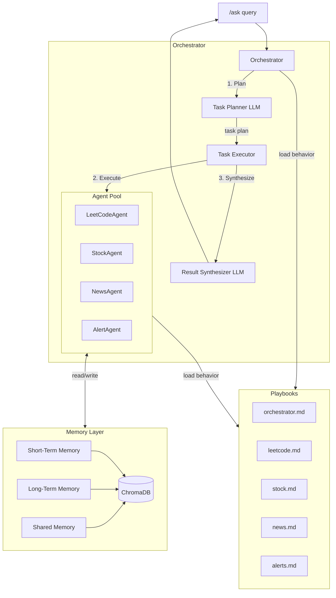

# Multi-Agent Orchestrator Architecture

## Overview

The bot uses an LLM-powered orchestrator that decomposes user queries, dispatches them to specialist agents (optionally in parallel), and synthesizes multi-agent results into a single response. All agents share a ChromaDB-backed RAG memory system with short-term, long-term, and cross-agent layers.



## Orchestrator Pipeline

The orchestrator (`agents/orchestrator.py`) replaces the old keyword-based router with a 3-phase pipeline:

### Phase 1: Plan

An LLM call analyzes the query and produces a structured task plan:

```python
@dataclass
class TaskPlan:
    agents: list[str]           # which agents to invoke
    subtasks: list[SubTask]     # specific instruction per agent
    parallel: bool              # run concurrently or sequentially
    needs_synthesis: bool       # whether to merge multi-agent results

@dataclass
class SubTask:
    agent_name: str
    instruction: str            # tailored prompt for this agent
    depends_on: list[str]       # agent names this subtask depends on
```

The planner uses the orchestrator playbook (`agents/playbooks/orchestrator.md`) and receives available agent capabilities plus user memory context. A keyword-based fallback handles cases where the LLM planner fails.

**Examples:**

| Query | Plan |
|-------|------|
| "What's AAPL trading at?" | `stock` only |
| "What's happening with AAPL?" | `stock` + `news` in parallel |
| "Get AAPL price, alert me if above $200" | `stock` then `alerts` sequentially |
| "Give me a random medium problem" | `leetcode` only |

### Phase 2: Execute

- **Parallel**: Independent subtasks run concurrently via `asyncio.gather`
- **Sequential**: Subtasks with dependencies run in order; each agent receives `peer_context` containing results from agents it depends on

### Phase 3: Synthesize

- **Single agent**: Result passes through directly (no extra LLM call)
- **Multiple agents**: An LLM call merges all agent outputs into one coherent response under 1800 characters

## Agent System

### BaseAgent (`agents/base.py`)

All agents inherit from `BaseAgent`, which provides:

- **Playbook-driven prompts**: System prompt loaded from `agents/playbooks/{name}.md` at init (no hardcoded strings)
- **ReAct loop**: Up to `max_iterations` cycles of LLM calls with tool use
- **RAG memory injection**: Before each run, semantically relevant memories are retrieved and injected into the system prompt
- **Peer context**: When running as part of a multi-agent task, agents can see other agents' results via the `peer_context` parameter
- **Memory tools**: `recall_memory`, `save_preference`, `save_fact` available to all agents

### Specialist Agents

| Agent | File | Service | Domain Tools |
|-------|------|---------|-------------|
| LeetCode | `agents/leetcode.py` | `LeetCodeService` | `get_daily_challenge`, `get_problem`, `search_problems`, `get_problems_by_tag`, `get_random_problem`, `get_user_stats` |
| Stock | `agents/stock.py` | `StockService` | `get_stock_quote`, `get_stock_summary`, `get_market_movers`, `search_stock_symbol` |
| News | `agents/news.py` | `NewsService` | `get_latest_news`, `get_market_news`, `search_news` |
| Alerts | `agents/alerts.py` | `AlertService` | `create_price_alert`, `create_reminder`, `list_alerts`, `delete_alert` |

All agents share a single `MemoryManager` instance (the memory system handles per-agent scoping internally).

## Playbook System

Agent behavior is defined in markdown files under `agents/playbooks/`:

| File | Purpose |
|------|---------|
| `_base.md` | Shared rules for all agents (memory usage, collaboration, formatting) |
| `orchestrator.md` | How to plan tasks, choose agents, and synthesize results |
| `leetcode.md` | LeetCode agent role, memory guidelines, collaboration rules |
| `stock.md` | Stock agent role, memory guidelines, collaboration rules |
| `news.md` | News agent role, memory guidelines, collaboration rules |
| `alerts.md` | Alerts agent role, memory guidelines, collaboration rules |

At init, each agent loads `_base.md` + its own playbook and uses the combined text as its system prompt. To change agent behavior, edit the `.md` file -- no code changes needed.

Each playbook defines:

- **Role**: What the agent is and what it does
- **Capabilities**: Summary of available tools
- **Guidelines**: Response style and formatting rules
- **Memory Guidelines**: What to save to long-term memory, what to share cross-agent
- **Collaboration**: How to behave when working alongside other agents

## Memory System

### Architecture

ChromaDB-backed RAG memory with three collections:

```
services/memory/
  __init__.py         # MemoryManager facade
  chroma_store.py     # ChromaDB wrapper (3 collections)
  short_term.py       # Recent conversations with TTL
  long_term.py        # Persistent facts and preferences
  shared.py           # Cross-agent knowledge base
  migration.py        # Legacy JSON-to-ChromaDB migration
```

### Collections

| Collection | Contents | Metadata | Expiry |
|-----------|----------|----------|--------|
| `short_term` | Conversation Q&A pairs | `user_id`, `agent_name`, `timestamp` | TTL-based (default 7 days) |
| `long_term` | User preferences, curated facts | `user_id`, `agent_name`, `category`, `importance` | Never |
| `shared` | Cross-agent knowledge | `source_agent`, `topic`, `timestamp` | Never |

### How Recall Works (RAG)

When an agent runs, `MemoryManager.recall()` performs semantic search:

1. Embed the current query
2. Search `short_term` for recent relevant conversations (filtered by `user_id` + `agent_name`)
3. Search `long_term` for relevant facts and preferences (filtered by `user_id`)
4. Search `shared` for cross-agent knowledge relevant to the query
5. Combine results into a `MemoryContext` and inject into the system prompt

Only semantically relevant memories are retrieved -- not all history. This saves context window tokens and surfaces the most useful context.

### Memory Tools

Agents have three memory tools:

| Tool | Purpose | Storage |
|------|---------|---------|
| `recall_memory` | Retrieve relevant past context for a user | Reads from all layers |
| `save_preference` | Save a user preference (e.g. watchlist, username) | Long-term (never expires) |
| `save_fact` | Save an important fact or insight | Long-term with importance level |

### Embeddings

- With `OPENAI_API_KEY` set: uses OpenAI `text-embedding-3-small` for high-quality embeddings
- Without API key: falls back to local `all-MiniLM-L6-v2` model (downloaded automatically, ~80MB)

### Data Storage

```
data/chromadb/           # ChromaDB vector store (auto-created on first use)
  chroma.sqlite3         # Metadata and mappings
  {collection-uuid}/     # Vector data per collection
```

## Configuration

All values from `.env` via `python-dotenv`:

| Variable | Default | Purpose |
|----------|---------|---------|
| `DISCORD_TOKEN` | required | Discord bot token |
| `OPENAI_API_KEY` | required | OpenAI API key for agents and embeddings |
| `AI_MODEL` | `gpt-4o-mini` | LLM model for agents and orchestrator |
| `AGENT_MAX_ITERATIONS` | `8` | Max ReAct iterations per agent run |
| `CHROMA_PERSIST_DIR` | `data/chromadb` | ChromaDB storage directory |
| `MEMORY_SHORT_TERM_TTL_DAYS` | `7` | Short-term memory expiry |
| `MEMORY_RECALL_LIMIT` | `5` | Number of memories to retrieve per recall |
| `EMBEDDING_MODEL` | `text-embedding-3-small` | OpenAI embedding model |

## Data Flow

| Feature | Flow |
|---------|------|
| `/ask "AAPL price and news"` | AICog -> Orchestrator -> Plan (stock+news parallel) -> Execute both -> Synthesize -> embed |
| `/ask "What's the daily?"` | AICog -> Orchestrator -> Plan (leetcode only) -> Execute -> pass through |
| `/ask "AAPL price, alert if above 200"` | AICog -> Orchestrator -> Plan (stock then alerts) -> Execute sequentially with peer_context -> Synthesize |
| `/leetcode daily` | LeetCodeCog -> LeetCodeService -> embed |
| `/stock quote AAPL` | StockCog -> StockService -> embed |
| Memory recall | Agent.run() -> MemoryManager.recall() -> ChromaDB semantic search -> inject into system prompt |
| Memory save | Agent tool call -> MemoryManager.save_preference/save_fact -> ChromaDB upsert |
